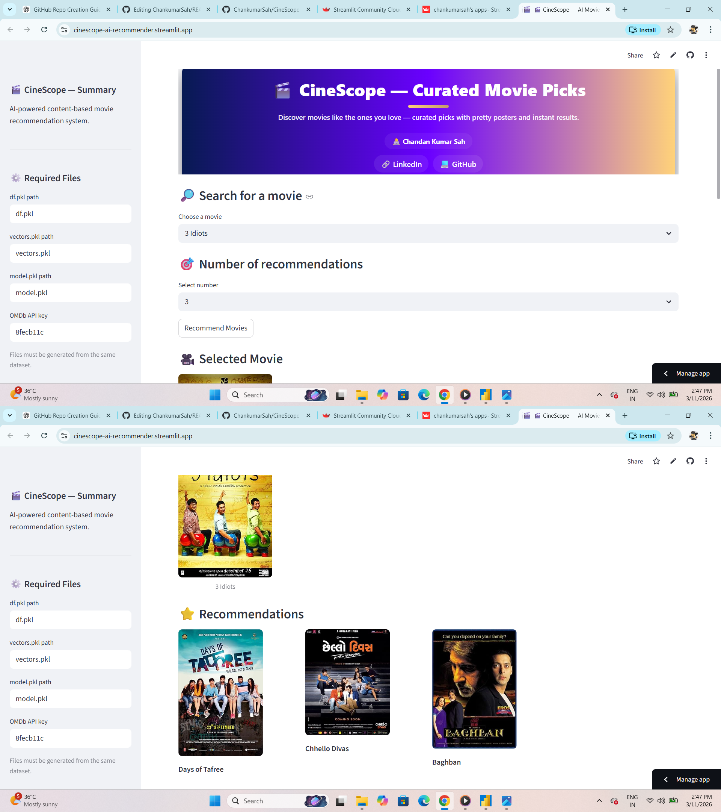

# 🎬 CineScope — AI Movie Recommender

An **AI-powered movie recommendation system** built using **Python and Streamlit** that suggests movies similar to the one you select.

The system uses **content-based filtering** and displays **movie posters, recommendations, and a clean interactive UI**.

---

# 🚀 Live Demo

🔗 **Try the app:**
https://cinescope-ai-recommender.streamlit.app

---

# 📊 Project Overview

CineScope recommends movies based on similarity between movie features such as:

* Genres
* Keywords
* Cast
* Crew
* Movie overview

Using these features, the system calculates **cosine similarity between movies** to generate recommendations.

---

# 🧠 How It Works

1. Movie metadata is cleaned and processed.
2. Important features are combined into a **tags column**.
3. Text data is converted into vectors using **CountVectorizer**.
4. **Cosine similarity** is calculated between movies.
5. When a user selects a movie, the system returns the **most similar movies**.

---

# 🛠 Tech Stack

### Programming

* Python

### Libraries

* Pandas
* NumPy
* Scikit-learn
* Pickle

### Web App

* Streamlit

### API

* OMDb API (for movie posters)

---

# 📷 App Preview



---

# ⚙️ Project Structure

```id="cscope_struct"
CineScope-AI-Recommender
│
├── app.py
├── model.pkl
├── df.pkl
├── vectors.pkl
├── movies.csv
├── cinescope_demo.png
└── README.md
```

---

# 📥 Installation

Clone the repository:

```id="clone_repo"
git clone https://github.com/ChankumarSah/CineScope-AI-Recommender.git
```

Go to the project folder:

```id="cd_repo"
cd CineScope-AI-Recommender
```

Install dependencies:

```id="install_deps"
pip install -r requirements.txt
```

Run the Streamlit app:

```id="run_app"
streamlit run app.py
```

---

# 🎯 Features

✔ AI movie recommendations
✔ Interactive Streamlit UI
✔ Movie poster display
✔ Adjustable number of recommendations
✔ Fast recommendation results

---

# 📊 Skills Demonstrated

* Machine Learning
* Recommendation Systems
* Natural Language Processing
* Data Preprocessing
* Streamlit App Development
* Python Data Analysis

---

# 👨‍💻 Author

**Chandan Kumar Sah**

Data Analyst | Python | SQL | Power BI | Machine Learning

🔗 GitHub:
https://github.com/ChankumarSah

🔗 LinkedIn:
(Add your LinkedIn profile link here)

---

⭐ If you like this project, consider giving it a **star on GitHub**.
